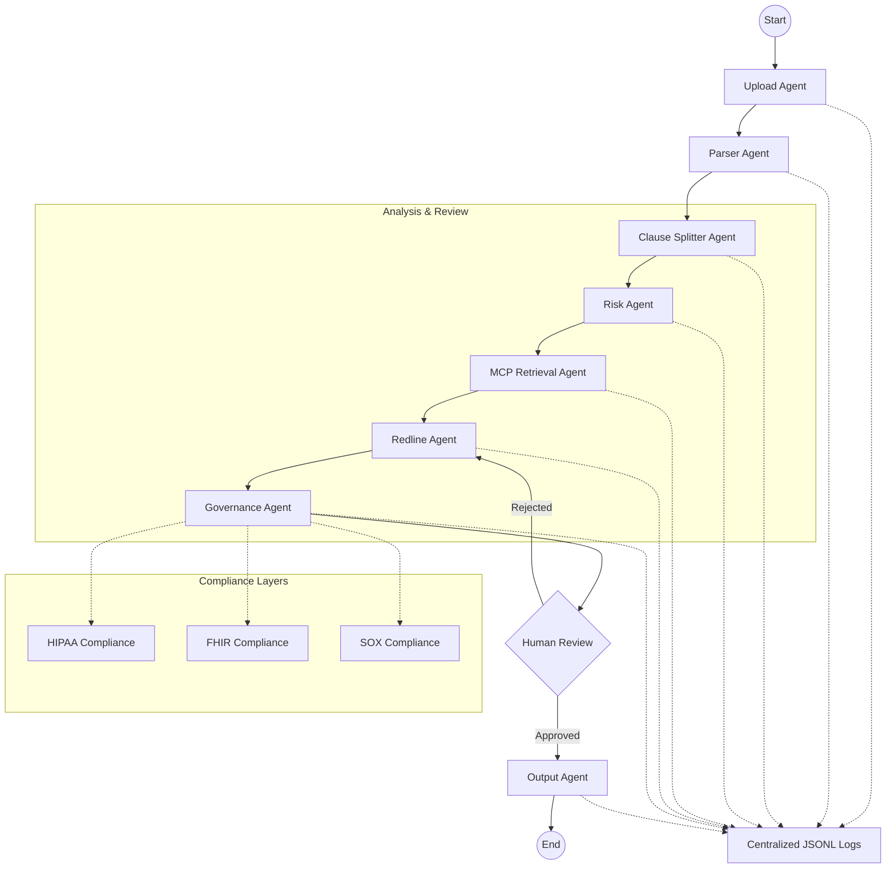

# Implementation Plan - Agentic Smart Contract Review Workflow

This plan outlines the transition to a standardized LangGraph-orchestrated multi-agent system for smart contract review, featuring specific processing stages, compliance governance (HIPAA, FHIR, SOX), and centralized JSONL logging.

## User Review Required

> [!IMPORTANT]
> **Human Review Step**: The workflow includes a `Human Review` stage that requires LangGraph's checkpointer and interrupt capabilities. This will change how the backend handles state persistence.
> 
> **MCP Retrieval**: Please confirm the specific MCP (Model Context Protocol) servers or endpoints to be used for retrieval.
> 
> **Compliance Definitions**: HIPAA, FHIR, and SOX compliance will be implemented as validation layers and audit logs. We need to define the specific PHI/PII fields to be monitored for HIPAA.

## Proposed Architecture

## Proposed Changes

### 1. LangGraph Workflow Orchestration
Refactor `backend/agents/contract_intelligence_agents.py` to use a more granular state and nodes.

#### [MODIFY] [contract_intelligence_agents.py](file:///c:/AI_Projects/contract_agent_capstone/backend/agents/contract_intelligence_agents.py)
- Define a new `ContractReviewState` with fields for compliance flags, human review status, and MCP context.
- Implement nodes for:
    - `upload_node`: Handles initial ingestion.
    - `parser_node`: Extracts structured text.
    - `splitter_node`: Identifies and splits clauses.
    - `risk_node`: Specialized risk assessment.
    - `mcp_retrieval_node`: Interface with Model Context Protocol.
    - `redline_node`: Intelligence-driven redlining.
    - `governance_node`: Compliance checker (HIPAA, FHIR, SOX).
    - `human_review_node`: Wait for user input using `interrupt`.
    - `output_node`: Final report generation.

### 2. Compliance Integration
Create a dedicated compliance service to handle regulatory logic.

#### [NEW] [compliance_service.py](file:///c:/AI_Projects/contract_agent_capstone/backend/shared/compliance_service.py)
- **HIPAA**: PII/PHI detection and masking utilities.
- **FHIR**: Mapping legal clauses to FHIR resources (e.g., `Consent`, `Contract`).
- **SOX**: Detailed audit logging for financial governance and internal controls.

### 3. Centralized JSONL Logging
Refactor the audit logging system to ensure every stage emits a JSONL entry.

#### [MODIFY] [audit_logger.py](file:///c:/AI_Projects/contract_agent_capstone/backend/infrastructure/audit_logger.py)
- Update `AuditLogger` to append to a centralized `.jsonl` file.
- Format: `{"timestamp": "...", "stage": "...", "agent": "...", "status": "...", "compliance_metadata": {...}, "output_summary": "..."}`.

### 4. MCP Retrieval Implementation
#### [NEW] [mcp_client.py](file:///c:/AI_Projects/contract_agent_capstone/backend/infrastructure/mcp_client.py)
- Implement a client to interact with MCP servers for specialized legal retrieval.

## Granular Task List

### Phase 1: Core Workflow Refactoring
- [ ] Define `ContractReviewState` in `backend/agents/intelligence_state.py`.
- [ ] Implement `upload_node` and `parser_node` in `contract_intelligence_agents.py`.
- [ ] Implement `splitter_node` using `backend/agents/chunking_agent.py` logic.

### Phase 2: Intelligence & Retrieval
- [ ] Implement `risk_node` and `redline_node`.
- [ ] Create `mcp_client.py` and integrate it into `mcp_retrieval_node`.
- [ ] Implement `governance_node` as a pre-human-review check.

### Phase 3: Compliance & Governance
- [ ] Create `compliance_service.py` with HIPAA, FHIR, and SOX validation logic.
- [ ] Integrate compliance checks into the `governance_node`.
- [ ] Add `interrupt` logic for Human-in-the-loop (HITL) review.

### Phase 4: Observability & Logging
- [ ] Refactor `audit_logger.py` for JSONL support.
- [ ] Add structured log calls to every LangGraph node.
- [ ] Implement a dashboard-friendly reporting node (`output_node`).

## Verification Plan

### Automated Tests
- `pytest tests/agents/test_langgraph_workflow.py`: Validate state transitions.
- `pytest tests/shared/test_compliance_service.py`: Verify HIPAA/SOX logic.
- `pytest tests/infrastructure/test_jsonl_logging.py`: Ensure logs are valid JSONL.

### Manual Verification
- Trigger a contract review via the API (`POST /analyze`).
- Use the LangGraph Studio or a custom tracker UI to verify the human review interruption.
- Inspect `logs/audit.jsonl` for completeness and compliance metadata.
