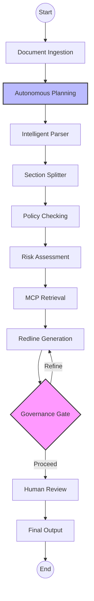
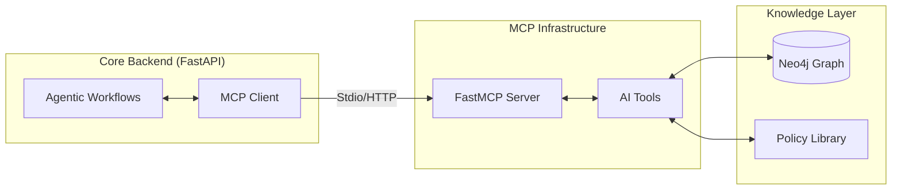

# Contract Intelligence Agent: System Overview

This document provides a comprehensive technical overview of the **Contract Intelligence Agent** platform, detailing its multi-agent orchestration, protocol integrations, and security frameworks.

---

## 🏗️ Multi-Agent Architecture

The platform is orchestrated by an **11-Node LangGraph State Machine**. Each node represents a specialized agent or functional stage in the contract lifecycle.

### Workflow Flow

### Key Components
- **Autonomous Planning Agent**: Analyzes the specific legal inquiry and document context to dynamically generate an execution strategy.
- **Section Splitter & Intelligent Parser**: Uses section-aware chunking to preserve legal context (e.g., keeping headers with their clauses).
- **Governance Gate**: Implements an iterative quality loop that automatically flags inconsistent redlines for refinement before final output.

---

## 🔗 Model Context Protocol (MCP) Integration

The system implements the **Model Context Protocol (MCP)** to provide a standardized, secure bridge between the internal contract knowledge base and external AI models.

### Architectural Bridge

### AI Toolset
Accessible via the MCP Server:
- **`search_clause_library`**: Semantic retrieval of standardized legal language.
- **`get_playbook_rule`**: Fetching corporate "Guardrails" for specific contract types.
- **`search_prior_approved_clauses`**: Historical precedent matching with approval confidence.
- **`fetch_contract_metadata`**: Direct retrieval of structured headers (Parties, Dates, Jurisdictions).

---

## 🛡️ Security & Observability

### Dual-Layer Audit Logging
We maintain a robust, non-repudiable audit trail across two distinct storage layers:
1.  **Graph Audit (Neo4j)**: Records every agent interaction, status change, and document access event as a nodes and relationships.
2.  **Log Audit (JSONL)**: A local `logs/audit.jsonl` file stores immutable snapshots for ingestion by external SIEM/Log-management tools.

### HIPAA-Compliant PII Masking
The system features an automated **Regex-Based Masking Engine** integrated into the `AuditLogger`. This layer ensures that sensitive data is sanitized before ever being persisted to a log:
- **Email/Phone/SSN Detection**: Automatically intercepts and replaces common PII patterns with `[MASKED]`.
- **Metadata Sanitization**: Recursively cleanses metadata objects to ensure unique IDs and sensitive fields are protected.
- **Automated Decorators**: Critical API endpoints and service methods are wrapped with the `@audit_log` decorator to ensure 100% observability coverage.

---

## 🛠️ Technical Stack

- **Agentic Engine**: LangGraph
- **Knowledge Base**: Neo4j Aura (Graph + Vector)
- **Protocol Layer**: FastMCP
- **Intelligence**: Google Gemini 1.5 Pro / Flash
- **Tracing**: Arize Phoenix
- **Backend API**: FastAPI (Async Python)
