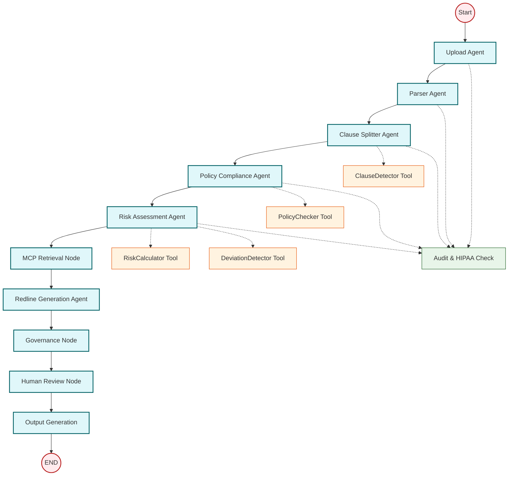
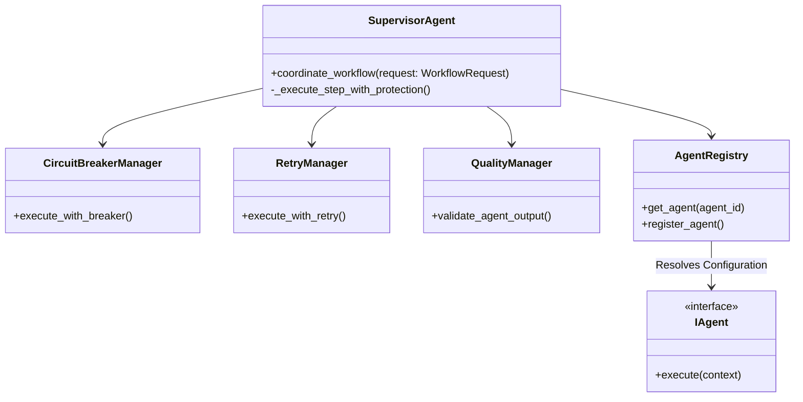
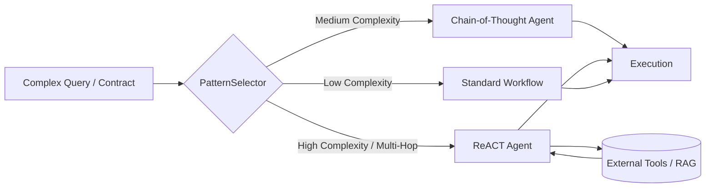

# Contract Intelligence Multi-Agent Architecture

This document outlines the multi-agent architecture implemented in the Contract Intelligence Platform. The system uses a hybrid approach, combining **state-machine driven orchestration** (LangGraph) for complex workflows with **SOLID-based supervisor patterns** for deterministic, resilient tasks.

## 1. High-Level Architecture Overview

The multi-agent system consists of three distinct layers of orchestration and execution:

1. **Intelligence Orchestrator (LangGraph)**: Manages the end-to-end lifecycle of contract analysis involving multiple phases (parsing, policy checking, risk assessment).
2. **Supervisor Agent (SOLID Pattern)**: Handles deterministic workflows with built-in resilience (Circuit Breakers, Retries, Quality Gates).
3. **Dynamic Pattern Selectors**: Chooses the appropriate reasoning strategy (ReACT or Chain-of-Thought) based on query and document complexity.

## 2. Intelligence Orchestrator Flow (LangGraph)

The primary document analysis workflow is built using `langgraph`. It ensures a deterministic sequence of agent invocations, passing a shared `IntelligenceState` through each node.

### Key Components:
- **State Management (`IntelligenceState`)**: Maintains the contract text, extracted clauses, policy violations, risk data, and step-by-step compliance status.
- **Audit & Compliance**: Every node invocation triggers `_log_and_check_compliance()` to generate structured audit logs (SOX) and check for PHI (HIPAA).
- **Tool Integration**: Nodes heavily rely on specialized tools (e.g., `OptimizedDeviationDetectorTool` based on CUAD standards) rather than raw LLM prompts.

## 3. Supervisor Coordination (SOLID Architectures)

For highly structured sequential tasks, the system uses a custom `SupervisorAgent` built on strict OOP principles. This layer is distinct from LangGraph and acts as an orchestration engine emphasizing reliability.

**Workflow Execution Example (`contract_analysis`):**
1. **PDF Processing Agent** -> Extract structural text.
2. **Clause Extraction Agent** -> Identify clauses.
3. **Risk Assessment Agent** -> Evaluate risks.

Each step is wrapped in the `CircuitBreakerManager` to prevent cascading failures if an LLM provider goes down, and validated by the `QualityManager` (which scores outputs based on structural integrity and completeness).

## 4. Adaptive Reasoning Strategies

For complex tasks requiring planning, the system employs dynamic cognitive patterns (located in `backend/agents/patterns`).

- **Pattern Selector**: Analyzes the input and routes to the most cost-efficient and capable agent.
- **ReACT Agent**: Used when the agent need to iteratively plan, use tools (like retrieval from Neo4j), observe the result, and decide the next action.
- **Chain of Thought**: Used when the task requires explicit, step-by-step logical reasoning to reach a conclusion without needing repeated external queries.

## 5. Agent Workflow Tracking

All agent executions, regardless of the orchestrator used, report to the `agent_workflow_tracker` (`backend/agents/agent_workflow_tracker.py`), which maintains an in-memory execution graph. This powers the visual Executive Dashboard, allowing users to see:
- Agent state (running, complete, error).
- Task duration.
- Extracted metadata (e.g., "Found 5 violations").
