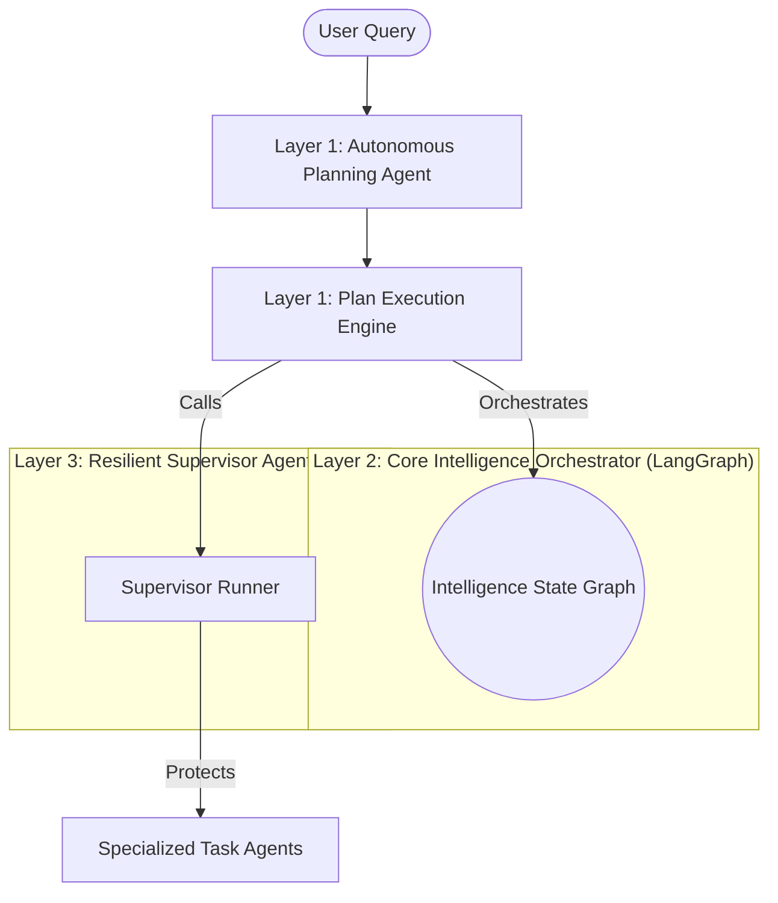
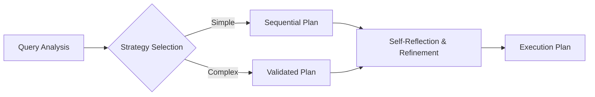
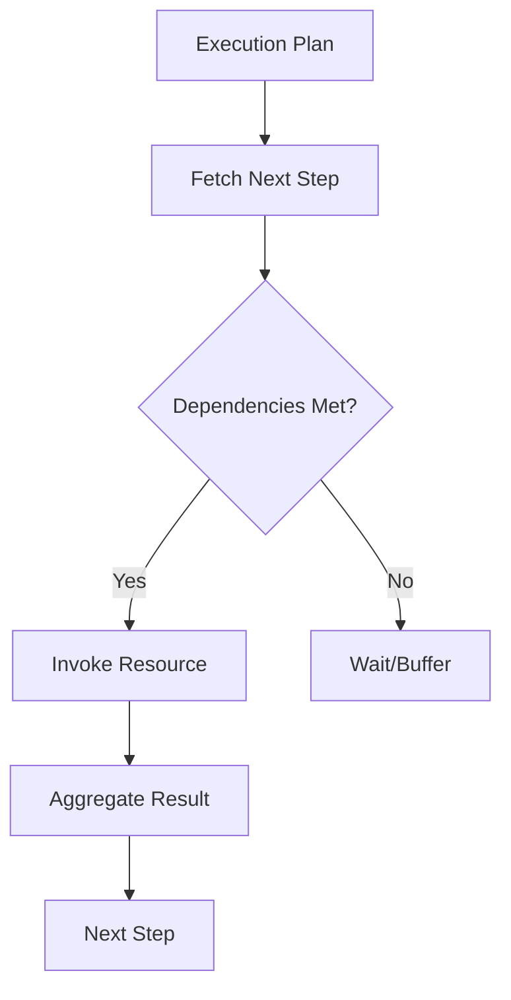
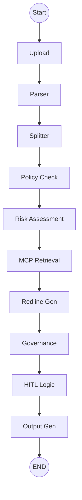
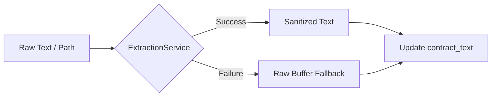
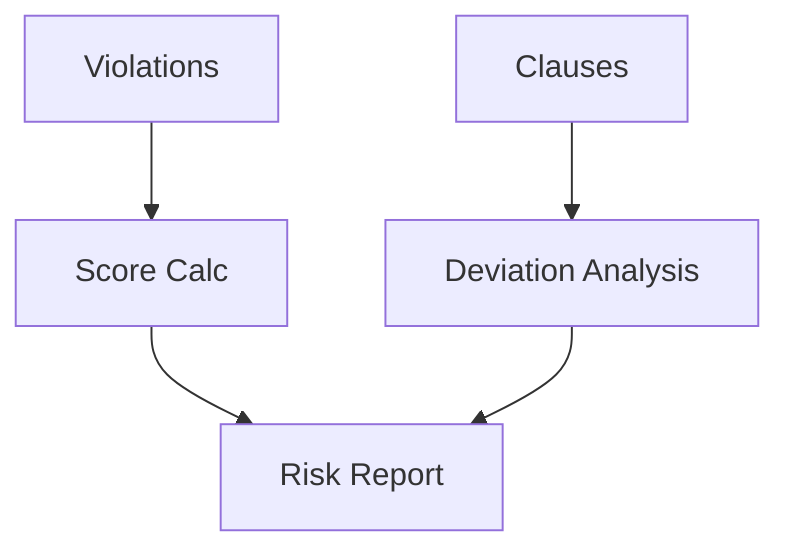
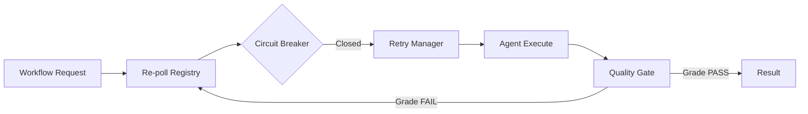

# Contract Intelligence: Multi-Agent Architecture Deep Dive

This document provides a comprehensive breakdown of the multi-agent system powering the Contract Intelligence platform. The architecture is designed for **autonomy**, **resilience**, and **observability**, utilizing a modular "Three-Layer" orchestration approach.

---

## 1. Executive Summary: The Orchestration Layers

Our system combines three distinct architectural patterns to balance flexibility and reliability:

1.  **Autonomous Planning Layer**: Dynamically creates execution strategies based on complex, open-ended user queries.
2.  **State-Graph Workflow Layer (Core Intelligence)**: A deterministic, 10-node sequential pipeline that ensures high-fidelity contract processing.
3.  **Resilient Supervisor Layer**: Operates as a protected execution wrapper for discrete tasks with built-in retries and circuit breakers.

---

## 2. Layer 1: Autonomous Planning & Reasoning

### 2.1. Autonomous Planning Agent
The "brain" of the system. It breaks down high-level user intents into a structured sequence of actions.

*   **Input**: Natural language strings (e.g., "Analyze this contract for risk and policy violations") sent from the API controller.
*   **Action**: 
    1. **QueryAnalyzer**: Categorizes the query by intent (risk, compliance, general) and calculates a complexity score (0.0 - 1.0).
    2. **Strategy Selection**: Selects a `PlanningStrategy` (Simple, Complex, Risk-Focused, or Compliance-Focused).
    3. **Plan Generation**: Creates a list of `ExecutionStep` objects with cross-step dependencies.
    4. **Self-Reflection**: Refines the plan by adding mandatory validation nodes if high-risk keywords are detected.
*   **Output**: A structured `ExecutionPlan` object sent to the **Plan Execution Engine**.

### 2.2. Plan Execution Engine
The runtime orchestrator for autonomous plans.

*   **Input**: The `ExecutionPlan` and the raw `contract_text`.
*   **Action**: Resolves the dependency graph of the plan. It uses the `AgentRegistry` to dynamically map plan step types (e.g., `EXTRACT_CLAUSES`) to the appropriate orchestrator or agent.
*   **Output**: A unified `Results` dictionary containing all extracted data, completions, and statuses.

---

## 3. Layer 2: Core Intelligence Workflow (LangGraph)

This layer uses a persistent **IntelligenceState** object that carries data from node to node.

### 3.1. Overview Workflow Diagram

### 3.2. Agent Profile: Upload Agent (`_upload_node`)
*   **Input**: Raw text buffer from the `document_upload` API.
*   **Action**: 
    - Initializes the `IntelligenceState` with `ingestion_timestamp`.
    - Updates `workflow_tracker` to track state progress.
*   **Output**: Hydrated metadata dictionary sent to the **Parser Agent**.

### 3.3. Agent Profile: Parser Agent (`_parser_node`)

*   **Input**: `metadata["file_path"]` or raw state buffer.
*   **Action**: Invokes `TextExtractionService` fallback strategy (OCR/PDF/Text) to remove noise and standardize encoding.
*   **Output**: Sanitized `contract_text` passed to the **Clause Splitter**.

### 3.4. Agent Profile: Clause Splitter Agent (`_splitter_node`)
*   **Input**: Sanitized `contract_text`.
*   **Action**: Calls the `ClauseDetectorTool` (LLM-backed) to identify discrete legal sections (e.g., Liability, Payment, Termination).
*   **Output**: `extracted_clauses` list (JSON) passed to **Policy Compliance Agent**.

### 3.5. Agent Profile: Policy Compliance Agent (`_check_policies`)
*   **Input**: `extracted_clauses`.
*   **Action**: Iterates through every clause using the `PolicyCheckerTool` which contains hardcoded corporate thresholds (e.g., "Net 30 preferred, Net 45 max").
*   **Output**: `policy_violations` list identifying exact issues, severity, and suggested fixes, passed to **Risk Assessment Agent**.

### 3.6. Agent Profile: Risk Assessment Agent (`_risk_node`)

*   **Input**: `extracted_clauses` and `policy_violations`.
*   **Action**: Calculates a risk score (0-100) using `RiskCalculatorTool`. Also triggers `OptimizedDeviationDetectorTool` (CUAD standards) to find subtle legal variations from "Gold Standard" templates.
*   **Output**: `risk_data` dictionary (score, level, legal_deviations) passed to **MCP Retrieval Agent**.

### 3.7. Agent Profile: MCP Retrieval Agent (`_mcp_retrieval_node`)
*   **Input**: `contract_text` and `extracted_clauses`.
*   **Action**: Use `OptimizedJurisdictionAdapterTool` and `OptimizedPrecedentMatcherTool` to retrieve external jurisdictional laws and similar historical contract precedents via the MCP layer.
*   **Output**: `mcp_context` (jurisdiction details and precedent links) passed to **Redline Generation Agent**.

### 3.8. Agent Profile: Redline Generation Agent (`_redline_node`)
*   **Input**: `policy_violations`.
*   **Action**: Uses `RedlineGeneratorTool` to map violations to specific "suggested_text" replacements defined in corporate policy.
*   **Output**: `redline_suggestions` list (original vs. suggested + justification) passed to **Governance Agent**.

### 3.9. Agent Profile: Governance Agent (`_governance_node`)
*   **Input**: The complete state assembled so far.
*   **Action**: Invokes the `compliance_service` to perform:
    - **HIPAA**: PHI/PII detection.
    - **FHIR**: Mapping clauses to interoperable medical schemas.
    - **SOX**: Generating a persistent, unchangeable audit trail.
*   **Output**: `compliance_status` summary passed to the **Human Review Node**.

### 3.10. Agent Profile: Human Review Node (`_human_review_node`)
*   **Input**: Risk score from `risk_data` and compliance status.
*   **Action**: A logic gate (No LLM). If Score > 70 or Privacy flagged, sets a hard block for manual approval.
*   **Output**: `human_review_required` boolean passed to the **Output Agent**.

### 3.11. Agent Profile: Output Agent (`_output_node`)
*   **Input**: Fully processed `IntelligenceState`.
*   **Action**: Aggregates final metadata, calculates processing time, and formats the ultimate JSON payload. Marks the workflow as "COMPLETED" in the tracker.
*   **Output**: Final structured report returned to the API caller.

---

## 4. Layer 3: Resilient Supervisor Agent (SOLID)

Designed for resilient, one-off task execution, the Supervisor follows strict OOP (SOLID) patterns to wrap standard agents in protective layers.

*   **Input**: A `WorkflowRequest` (specific agent ID, workflow type).
*   **Action**: 
    1. **Circuit Breaker**: Stops execution if the agent (e.g. OpenAI) has consistently timed out in the last 15 seconds.
    2. **Retry Manager**: Automatically retries 429/500 errors.
    3. **Quality Manager**: Performs a "Score & Grade" check on the output to ensure the JSON is valid and complete.
*   **Output**: `WorkflowResult` containing the data and a confidence grade (A/B/C).

---

## 5. Cognitive Reasoning Patterns

The system dynamically switches "thinking" styles via the `PatternSelector`.

| Pattern | Best For | Architecture |
| :--- | :--- | :--- |
| **ReACT** | Multi-hop tool usage, Neo4j graph traversal | Thought → Action → Observation → Final Answer |
| **Chain-of-Thought** | Complex logic, Risk reasoning, Clause comparison | Step-by-step internal derivation |
| **Standard** | High-speed linear tasks | Direct LLM prompt/response |
